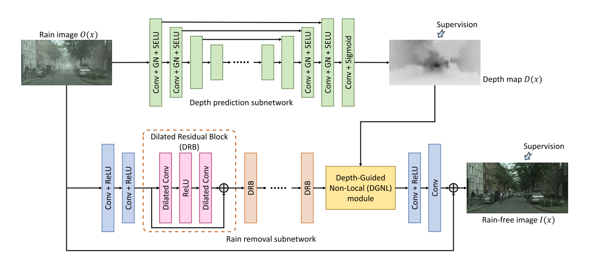
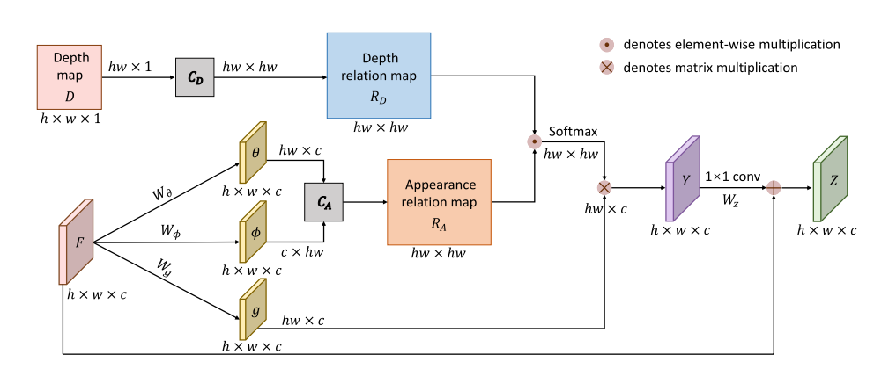

# Derain 去雨修复
**1. Single-Image Real-Time Rain Removal Based on Depth-Guided Non-Local Features** [paper](https://ieeexplore.ieee.org/document/9318521) | [code](https://github.com/xw-hu/DGNL-Net) TIP2021*

author: Xiaowei Hu, Lei Zhu, Pheng-Ann Heng et al. CUHK

> Existing datasets and methods for rain removal ignore depth physical properties, thus limiting the rain removal efficiency on real photos.
>
> We construct **the depth-guided non-local (DGNL) module** to learn non-local features in a depth-guided manner and design an end-to-end lightweight deep neural network to achieve real-time single-image rain removal.

