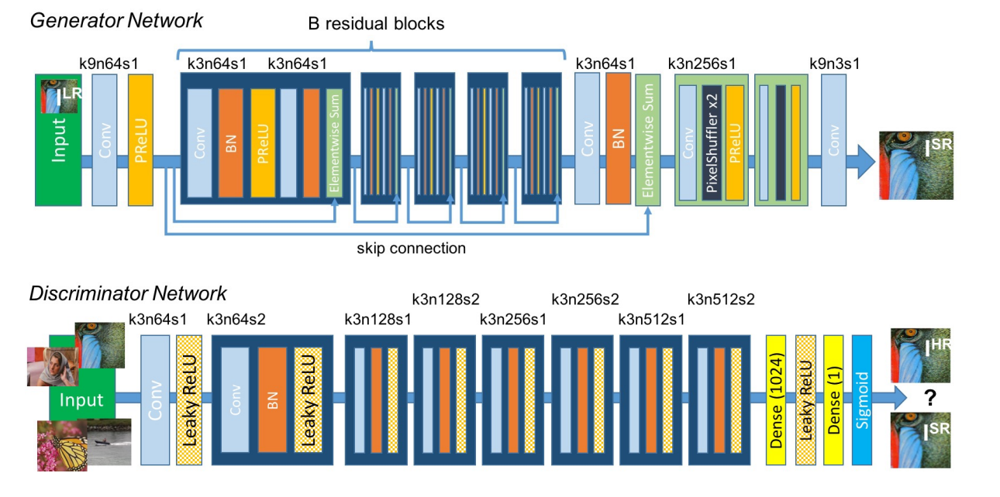

# Super Resolution 超分辨率修复

**1. Blueprint Separable Residual Network for Efficient Image Super-Resolution** [paper](https://arxiv.org/abs/2205.05996) | [code](https://github.com/xiaom233/BSRN) NTIRE 2022 1st & CVPR2022 workshop

author: Zheyuan Li, Yingqi Liu, Xiangyu Chen et al. Shenzhen Institutes of Advanced Technology, Chinese Academy of Sciences

> 1. 在[RFDN](https://openaccess.thecvf.com/content_CVPR_2020/papers/Liu_Residual_Feature_Aggregation_Network_for_Image_Super-Resolution_CVPR_2020_paper.pdf)的基础上，采用[BSConv(蓝图卷积)](https://arxiv.org/abs/2003.13549)提取shallow feature，BSConv是DSConv深度可分离卷积的变种，参数量少，减少冗余卷积操作。
>
> 2. 引入ESDB(Efficient Separable Distillation Block), 将原始RFDB模块的SRB改成带BSConv的BSRB进行特征浓缩/细化，引入ESA增强空间注意模块和CCA对比度感知通道注意模块进行特征增强。

思考：ESA和CCA注意力模块虽然增加一定计算量，但采用BSConv优化卷积，相比于RFDN有效减少参数量。但是论文表明即使参数量的减少，推理速度并没有提高，初步猜测和注意力模块、多尺度级联并行Concat有关。

**2. (SRGAN)Photo-Realistic Single Image Super-Resolution Using a Generative Adversarial Network** [paper](https://arxiv.org/abs/1609.04802) | [code](https://github.com/tensorlayer/srgan)  CVPR2017

authors: Christian Ledig, Lucas Theis, Ferenc Huszar, et al. Twitter 

> 1. SGGAN由SSResNet Generator和Discriminator组成，损失函数由对抗损失adversarial loss(**结合GAN提高真实感**)和内容损失content loss组成，而content loss由MSE损失(**像素级相似性**)和**perceptual loss感知损失**(**特征相似性**)组成。
>
> 2. **perceptual loss感知损失**是基于VGG不同卷积层输出的feature map的MSE损失
> 3. 结合GAN的训练方式(**条件GAN**)和**感知损失**使超分修复图像更符合人眼感知(MOS主观评估手段)，而PSNR/SSIM越高，人眼感知效果可能下降。

